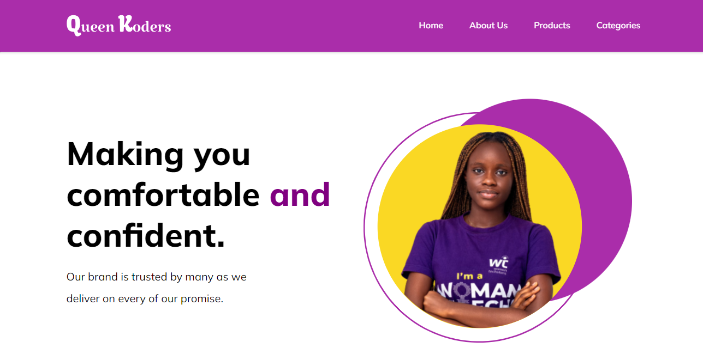

# Spotify Clone Project

## Task

- This is a simple project done by the Queen Koders team which involves fetching data from an API ([FakeStore API](https://fakestoreapi.com/docs)) and displaying it on the user interface.

 ## Guideline to view the project

 To view the project on your local machine.
 - Clone the repository 

 ``https://github.com/Perpy-del/queen-koders-ecommerce``

 - Change your current working directory to the project directory

 ``cd queen-koders-ecommerce``

 - Open the index.html file and run it on your local machine

 ## Contributors include
 - [Tosin Bamidele](https://github.com/TosinMary) 
 - [Chizaram Anisimuo](https://github.com/thezaram)
 - [Sylvia Nnoruka](https://github.com/SYLVIANNORUKA)
 - [Blessing Peter](https://github.com/blessingpeters)
 - [Stella Ugoo-Okonkwo](https://github.com/Ozyugoo)
 - [Wokrit Bakkuk](https://github.com/wokrit)
 - [Perpetual Meninwa](https://github.com/Perpy-del)
 - [Chioma Ekpemerechi](https://github.com/codiadem)
 - [Udoka Kasie](https://github.com/UdokaSuccess)

 ## Deployment
 The project was done using HTML and vanilla CSS. It was deployed using Vercel. Here is the link to the deployed project.
 [Queen Koders ECommerce](https://queen-koders-ecommerce.vercel.app)

 ## Screenshot of the project
